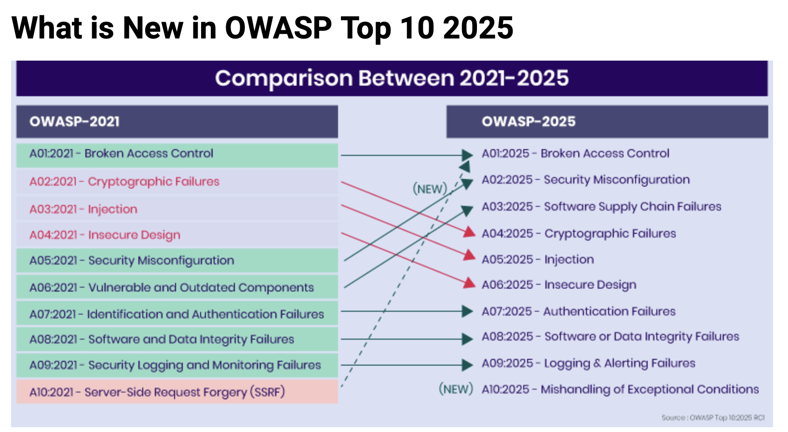
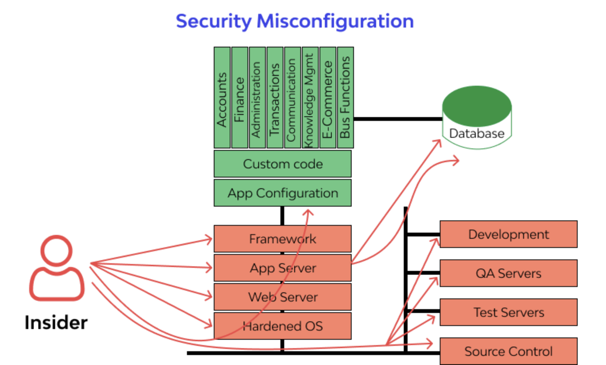
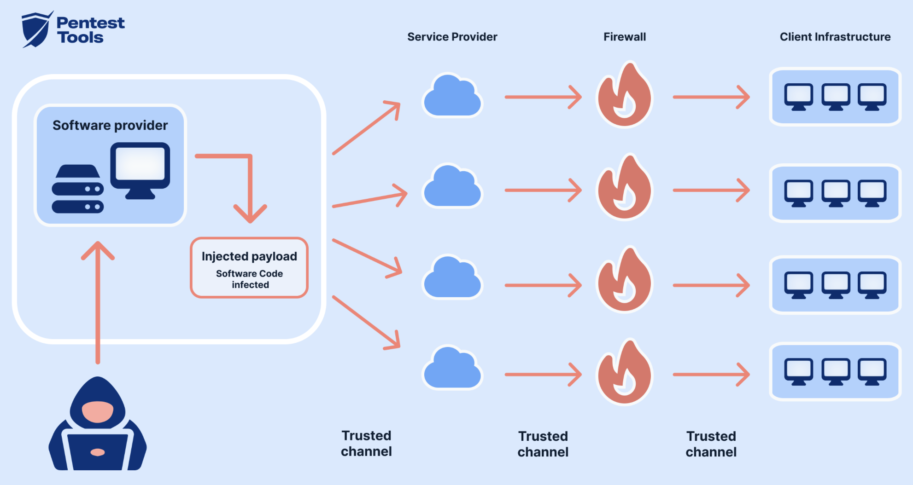

 # OWASP TOP 10 


# Integrantes

- Bernal Arcieri Laura Vanessa
- Reynel Alfonso Cely Gomez
- Bayardo Alejandro Medina Diaz
- Johanna Ortiz Pacheco

## Introducción

OWASP (Open Web Application Security Project) es una organización sin ánimo de lucro enfocada en mejorar la seguridad del software.
El OWASP Top 10 es un documento de concientización que identifica los riesgos de seguridad más críticos en aplicaciones web. Representa un amplio consenso de expertos en seguridad a nivel mundial y sirve como referencia para desarrolladores, arquitectos de software y equipos de gestión de riesgos.
Esta clasificación se actualiza aproximadamente cada cuatro años, evaluando y priorizando las vulnerabilidades más relevantes según su impacto y frecuencia. En el presente trabajo se analizarán diez vulnerabilidades incluidas en el Top 10, detallando su descripción, métodos de explotación y mejores prácticas de mitigación.
El OWASP Top 10 no es simplemente una lista de vulnerabilidades, sino un reflejo de cómo la seguridad en el desarrollo de software evoluciona constantemente. A continuación, se presenta una imagen comparativa que muestra cómo las vulnerabilidades han cambiado su posición entre 2021 y 2025, evidenciando la actualización más reciente realizada por la organización y cómo el panorama de amenazas continúa transformándose a nivel mundial.

<p align="center">
  
</p>

# A01:2025 – Broken Access Control
Es vulnerabilidad se lleva acabo cuando una aplicación no restringe adecuadamente las acciones que un usuario autenticado puede realizar, basicamente nos indica el Broken Access Control el usuario está autenticado, pero puede acceder a recursos o funciones que no debería, como se evidencia en la siguiente imagen.
<p align="center">
  
</p>

## Naturaleza del problema

- Falta de validación en backend
- Validaciones solo en frontend
- Uso incorrecto de roles
- Ausencia de controles de autorización


## Impacto potencial

- Acceso a datos sensibles
- Escalamiento de privilegios
- Modificación o eliminación de información
- Compromiso total del sistema

## Métodos de Explotación

### IDOR (Insecure Direct Object Reference)

Un **IDOR** ocurre cuando una aplicación utiliza un identificador directo (por ejemplo, un número de usuario o de cuenta) en la URL o en un parámetro, sin validar correctamente si el usuario autenticado tiene permisos para acceder a ese recurso.


**1️⃣ suario  legítimo accede a su cuenta:**
https://app.universidad.com/account?id=1001


El sistema muestra la información correspondiente a la cuenta **1001**.

---

**2️ Manipulación  del parámetro por parte del atacante:**

El atacante modifica manualmente el valor del identificador en la URL:
https://app.universidad.com/account?id=1002


Si el sistema **no valida la autorización correctamente**, mostrará la información de la cuenta **1002**, que pertenece a otro usuario. Como resultado acceso no autorizado a información de otra cuenta de usuario.

---

## Escalamiento Vertical de Privilegios

El **escalamiento vertical de privilegios** ocurre cuando un usuario con permisos básicos logra acceder a funcionalidades restringidas para administradores u otros roles con mayor nivel de acceso.


### Ejemplo de acceso indebido

Un usuario normal intenta acceder directamente a un recurso administrativo:
/admin/deleteUser


Si la aplicación no valida correctamente los permisos en el backend, el usuario podría ejecutar acciones exclusivas de administrador.

---

### Bypass de autorización mediante manipulación de JWT

En aplicaciones que utilizan **JSON Web Tokens (JWT)** para la autenticación, el atacante puede intentar modificar el contenido del token si este no está correctamente firmado o validado.

Ejemplo de campo manipulado:

```json
{
  "role": "admin"
}
```

Si el servidor no verifica correctamente la firma del token o confía únicamente en el contenido del campo role, el atacante podría obtener privilegios de administrador.

### Las herramientas más usadas para explotar este tipo de vulnerabilidades son:
- Burp Suite
- OWASP ZAP
- Postman

## Casos reales 

- Exposición masiva de datos en APIs por falta de validación de permisos en endpoints REST.
- Un atacante simplemente fuerza a los navegadores a acceder a las URL objetivo. Se requieren derechos de administrador para acceder a la página de administración.

## Mejores practicas 

- Implementar control de acceso en el backend
- Aplicar el principio de mínimo privilegio
- Validar permisos en cada request
- Usar RBAC o ABAC correctamente
- No confiar en datos del cliente (JWT sin validar)
- Realizar pruebas de autorización automatizadas

---

## A02:2025 Security Misconfiguration
Ocurre cuando los sistemas, frameworks, servidores o aplicaciones están mal configurados generando vulnerabilidades

<p align="center">
  
</p>

## Causas comunes

- Credenciales por defecto
- Puertos abiertos innecesarios
- Servicios expuestos
- Headers de seguridad ausentes
- Directory listing habilitado
- Errores detallados visibles

## Impacto

- Acceso no autorizado
- Filtración de información
- Compromiso del servidor
- RCE (Remote Code Execution)

## Métodos de Explotación 

Uso de credenciales por defecto
Ejemplo:

admin / admin

## Acceso a paneles expuestos


/phpmyadmin
/admin

## Enumeración de directorios

https://site.university.com/uploads/


## Exploits conocidos en software sin parches
Herramientas usadas
- Nmap
- Nikto


## Casos reales
- Exposición pública de bases de datos Elasticsearch sin autenticación.
- Consolas administrativas expuestas en la nube.


## Mejores Prácticas de Prevención
- Hardening de servidores
- Eliminar credenciales por defecto
- Aplicar parches regularmente
- Deshabilitar servicios innecesarios
- Implementar Infrastructure as Code segura

---

## A03:2025 Software Supply Chain Failures
Se refiere a vulnerabilidades introducidas a través de dependencias externas, librerías, paquetes, contenedores o procesos CI/CD comprometidos. O cambios maliciosos en código, herramientas u otras dependencias de terceros de las que depende el sistema.

<p align="center">
  
</p>

## Naturaleza
- Uso de librerías vulnerables
- Dependencias maliciosas
- Ataques de dependency confusion
- Compromiso de repositorios

## Impacto
- Ejecución remota de código
- Robo de credenciales
- Compromiso de pipelines
- Distribución de malware a clientes


## Métodos de Explotación

## Dependency Confusion

Publicar un paquete malicioso con el mismo nombre que uno interno.

## Compromiso de repositorios
Ejemplo:
Ataque a SolarWinds, Cisco, FORTINET

## Inyección en pipeline CI/CD
- Modificar artefactos antes del despliegue.

 Herramientas utilizadas
- Snyk
- OWASP Dependency-Check
- npm audit

## Casos reales
- Actualizaciones comprometidas
- Dependencias vulnerables ampliamente utilizadas
- Publicación de paquetes maliciosos

---

## Mejores Prácticas de Prevención
- Inventario de dependencias (SBOM)
- Escaneo continuo de vulnerabilidades
- Verificación de integridad (hashes)
- Firmado de artefactos
- Uso de repositorios privados
- Revisión manual de dependencias críticas
- Implementar DevSecOps en CI/CD


## A07:2021 - Identification and Authentication Failures


#Referencias 
https://owasp.org/www-project-top-ten/
https://www.indusface.com/learning/owasp-top-10-vulnerabilities/
https://owasp-org.translate.goog/Top10/2025/A01_2025-Broken_Access_Control/?_x_tr_sl=en&_x_tr_tl=es&_x_tr_hl=es&_x_tr_pto=tc
https://owasp-org.translate.goog/Top10/2025/A02_2025-Security_Misconfiguration/?_x_tr_sl=en&_x_tr_tl=es&_x_tr_hl=es&_x_tr_pto=tc
https://owasp-org.translate.goog/Top10/2025/A03_2025-Software_Supply_Chain_Failures/?_x_tr_sl=en&_x_tr_tl=es&_x_tr_hl=es&_x_tr_pto=tc
https://csrc.nist.gov/Projects/ssdf
https://www.enisa.europa.eu/publications/threat-landscape-for-supply-chain-attacks


