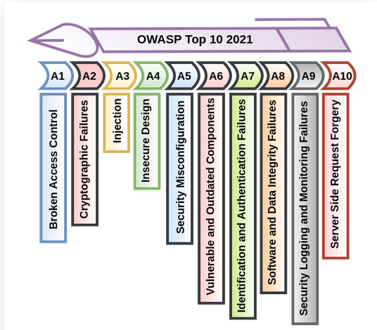

# 🔐 Taller: Análisis de Vulnerabilidades en el OWASP Top 10  
### Métodos de Explotación y Prevención

---

## 👥 Integrantes

- Ing. Argel Ochoa Ronald David  
- Ing. Baquero Soto Mauricio  
- Ing. Buitrago Guiot Oscar Javier  
- Ing. Estefania Naranjo Novoa  

---

## 📌 Introducción

La seguridad en aplicaciones web se ha convertido en un componente crítico para las organizaciones debido al incremento constante de ataques dirigidos a sistemas expuestos en Internet.

El proyecto **OWASP Top 10** constituye una referencia mundial que identifica las vulnerabilidades más críticas en aplicaciones web, proporcionando una guía para desarrolladores, arquitectos de software y equipos de seguridad.

Este trabajo tiene como propósito analizar cada vulnerabilidad incluida en el OWASP Top 10, identificar los métodos de explotación utilizados por los atacantes y proponer estrategias de prevención alineadas con buenas prácticas de seguridad y enfoques DevSecOps.

---

## 🎯 Objetivo General

Analizar las vulnerabilidades incluidas en el OWASP Top 10, identificando sus mecanismos de explotación, impactos en aplicaciones web y estrategias de prevención, con el fin de fortalecer el conocimiento en seguridad de software y promover el desarrollo de aplicaciones seguras.

---

## 🎯 Objetivos Específicos

- Identificar y describir las vulnerabilidades presentes en el OWASP Top 10.
- Analizar causas, características y riesgos asociados.
- Investigar métodos y técnicas de explotación utilizadas por atacantes.
- Proponer medidas de prevención y mitigación basadas en principios DevSecOps.

---

## 🌍 ¿Qué es OWASP?

OWASP (Open Web Application Security Project) es una organización sin fines de lucro cuyo objetivo principal es mejorar la seguridad del software mediante proyectos de código abierto, documentación técnica, estándares y educación en seguridad informática.

Más información:  
https://owasp.org/www-project-top-ten/

---

# 🛡 OWASP Top 10 (Edición 2021)

A continuación, se describen las principales vulnerabilidades identificadas en la edición 2021:

---

*Fuente: OWASP Foundation (2021)*

*Fuente: OWASP Foundation (2021)*

## 1️⃣ Control de Acceso Roto (Broken Access Control)

**Descripción:**  
Ocurre cuando los usuarios pueden actuar fuera de los permisos asignados.

**Métodos de explotación:**
- Manipulación de URLs
- Fuerza bruta sobre identificadores
- Modificación de tokens o cookies

**Prevención:**
- Validación de permisos en el servidor
- Principio de mínimo privilegio
- Control de roles adecuado

---

## 2️⃣ Fallos Criptográficos (Cryptographic Failures)

**Descripción:**  
Protección inadecuada de datos sensibles.

**Métodos de explotación:**
- Interceptación de tráfico sin HTTPS
- Contraseñas almacenadas en texto plano
- Uso de hashes débiles

**Prevención:**
- Uso obligatorio de HTTPS/TLS
- Hashing seguro (bcrypt, Argon2)
- Gestión adecuada de claves

---

## 3️⃣ Inyección (Injection)

**Descripción:**  
Entrada maliciosa interpretada como comandos o consultas.

**Ejemplos:**
- SQL Injection  
- Command Injection  
- LDAP Injection  

**Prevención:**
- Consultas parametrizadas
- Validación estricta de entradas
- Uso de ORM seguros

---

## 4️⃣ Diseño Inseguro (Insecure Design)

**Descripción:**  
Falta de controles de seguridad desde la arquitectura inicial.

**Prevención:**
- Modelado de amenazas
- Arquitectura segura por diseño
- Pruebas de seguridad tempranas

---

## 5️⃣ Configuración de Seguridad Incorrecta (Security Misconfiguration)
**Descripción:**  
Errores en configuración de servidores o frameworks.

**Prevención:**
- Hardening del servidor
- Eliminación de configuraciones por defecto
- Automatización de despliegues seguros

---

## 6️⃣ Componentes Vulnerables y Desactualizados

**Descripción:**  
Uso de librerías con vulnerabilidades conocidas.

**Prevención:**
- Inventario de dependencias
- Actualizaciones periódicas
- Uso de herramientas SCA

---

## 7️⃣ Fallos de Identificación y Autenticación

**Descripción:**  
Problemas en gestión de credenciales y sesiones.

**Prevención:**
- Autenticación multifactor
- Políticas de contraseñas robustas
- Expiración segura de sesiones

---

## 8️⃣ Fallos en Integridad de Software y Datos

**Descripción:**  
Manipulación de dependencias o pipelines.

**Prevención:**
- Firmas digitales
- Verificación de integridad
- Seguridad en la cadena de suministro

---

## 9️⃣ Registro y Monitoreo Insuficiente

**Descripción:**  
Falta de logs adecuados para detectar incidentes.

**Prevención:**
- Registro centralizado
- Alertas automáticas
- Integración con SIEM
